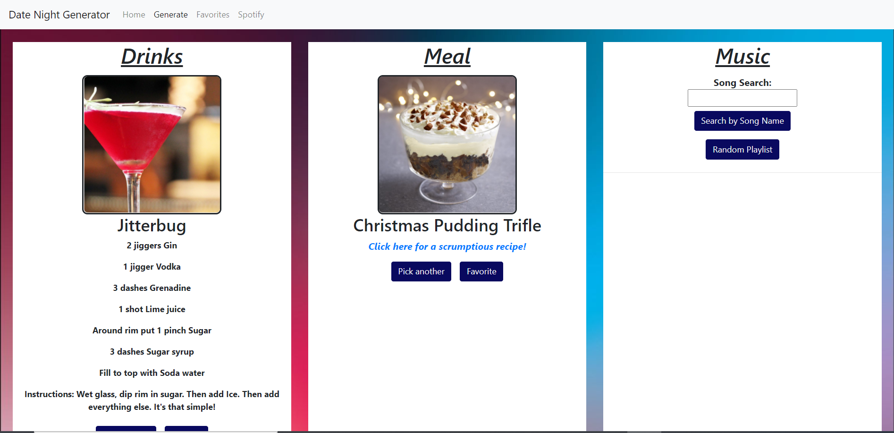

# Virtual Date Night

## Contributors
Andi Virgen, Marisa Diaz, Christian Miller

## Team Repository
[Click here](https://github.com/andrealejandra/Project_1) for link to team project repository.

## Story
Scenario: You're in isolation, like a good person, but you are also a single pringle, so what do you do? Go on virtual dates in order to try to shed that single pringle status.
However, you have a big dilemma. What exactly do you want to do for your virtual date night? What drink do you want? What kind of meal do you want? What kind of mood do you want? 
You want to make a lasting impression through the screen and yet your stress inhibits your creativiy. So, what now?

Go on the internet and let it choose for you of course!

Upon landing on the home page, the user will see that the nav bar with the name of the website 'Virtual Date Night' up on the top. Next to it will be links to the individual pages,
Drinks, Meals, Music, random Spotify playlist, and Random. 

On the landing page, the user will select the link that will take them to the results page.
The results page will allow the user to select the Drink & Meal with different catergories and based on the user input, music will populate the next area.

## Deployment
[Click here](https://cnmiller127.github.io/DinnerDateGenerator/) to interact with the deployed app.

## Preview

